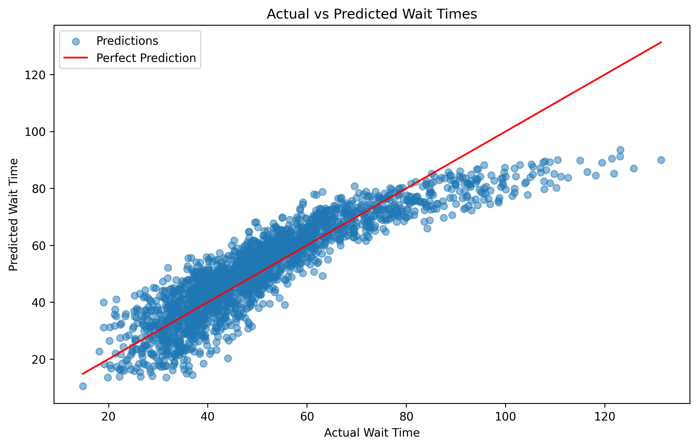

# Project Title: Emergency Department Wait Time Prediction

## Overview
Efficient management of emergency department (ED) wait times is critical for patient care. This project uses data science to predict ED wait times based on factors like patient volume, staffing, and acuity levels, helping optimize hospital operations.

---

## Objectives
- Predict wait times using machine learning models.
- Identify key factors that influence wait times.
- Provide actionable recommendations for resource optimization.

---

## Data Description
This project uses **synthetic data** to simulate real-world ED scenarios:
- **Features**:
  - `arrival_time`: Hour of patient arrival (0–23).
  - `acuity_level`: Severity of the condition (1 = most critical, 5 = least critical).
  - `current_patient_volume`: Total number of patients in the ED.
  - `staff_on_duty`: Number of staff available.
- **Target**:
  - `wait_time`: Calculated wait time based on realistic assumptions and noise.

---

## Approach
1. **Data Simulation**: Generate synthetic data using Python libraries (`numpy`, `pandas`).
2. **Modeling**:
   - Train a **Linear Regression** model to predict wait times.
   - Evaluate performance using **MAE** and **R²**.
3. **Visualization**: Plot actual vs. predicted wait times to evaluate model accuracy.

---

## Key Results
- **Mean Absolute Error (MAE)**: 6.33 minutes (average prediction error).
- **R² Score**: 0.79 (model explains 79% of variability in wait times).
- High patient-to-staff ratios and low acuity levels significantly influence wait times.

---

## Recommendations
- **Dynamic Staffing**: Increase staff during peak hours.
- **Triage Optimization**: Streamline prioritization for high-acuity cases.
- **Capacity Planning**: Use predictions to prepare for seasonal surges (e.g., flu seasons).

---

## Visualization
The plot below compares predicted vs. actual wait times:



---

## Future Work
- **Feature Expansion**: Incorporate additional variables like diagnostic times and lab results.
- **Advanced Models**: Experiment with tree-based models (e.g., Random Forests, Gradient Boosting) or neural networks.
- **Real-World Integration**: Apply the model to real ED data and build a live dashboard with tools like Streamlit or Dash.

---

## How to Run
1. **Clone the Repository**:
   ```bash
   git clone https://github.com/yourusername/project-name.git
   cd project-name
